# AI-Driven Agricultural Intelligence System: Technical Report

**Version:** 1.2
**Date:** 2024-08-03

---

## Table of Contents

1.  [Introduction](#1-introduction)
2.  [System Architecture and AI Pipeline](#2-system-architecture-and-ai-pipeline)
3.  [Dataset Information](#3-dataset-information)
4.  [Methodology and AI Components](#4-methodology-and-ai-components)
    *   [4.1 Weather Data Integration and Analysis](#41-weather-data-integration-and-analysis)
    *   [4.2 Crop Price Prediction using N-BEATS](#42-crop-price-prediction-using-n-beats)
    *   [4.3 Soil Classification using ResNet50](#43-soil-classification-using-resnet50)
    *   [4.4 Plant Disease Detection using CNN](#44-plant-disease-detection-using-cnn)
    *   [4.5 Crop Recommendation Engine](#45-crop-recommendation-engine)
    *   [4.6 Output Summarization using LLM](#46-output-summarization-using-llm)
5.  [Results Summary](#5-results-summary)
6.  [Conclusion and Future Work](#6-conclusion-and-future-work)

---

## 1. Introduction

Agriculture faces numerous challenges, including unpredictable weather patterns, volatile market prices, maintaining soil health, and managing crop diseases. To address these issues and empower farmers with data-driven insights, we have developed an AI-driven Agricultural Intelligence System. This system integrates various machine learning models to provide comprehensive recommendations and forecasts tailored to the farmer's context.

The core AI components driving this system are:
*   Weather Data Integration and Forecasting Analysis
*   Time-Series Crop Price Prediction
*   Image-Based Soil Type Classification
*   Image-Based Plant Disease Detection
*   An integrated Hybrid AI Crop Recommendation Engine
*   Natural Language Summarization of Outputs via LLM

This report outlines the architecture, data sources, methodologies, and evaluation approaches for these AI components, emphasizing the rationale behind model choices and their roles within the overall system.

---

## 2. System Architecture and AI Pipeline

The system employs a modular pipeline architecture, allowing for specialized AI models to contribute to a holistic analysis and recommendation framework.

1.  **Weather Data Integration:** Acquires historical and projected weather parameters crucial for agriculture (e.g., temperature, precipitation, radiation) from reliable sources.
2.  **Price Prediction Module:** Utilizes time series forecasting models (N-BEATS), informed by historical prices and weather covariates, to predict future crop market prices.
3.  **Soil Classification Module:** Leverages deep learning (ResNet50) to classify soil type from user-provided images.
4.  **Disease Detection Module:** Employs computer vision (CNN) to identify common plant diseases from leaf images.
5.  **Crop Recommendation Engine:** A central Hybrid AI component synthesizes information from preceding modules, external news context (via RAG), and platform-specific data (e.g., subsidies) to generate ranked and explained crop suggestions.
6.  **Output Summarization Layer:** Uses a Large Language Model (LLM, accessed via Ollama) to translate the engine's recommendations and supporting data into clear, actionable advice for the farmer.

This architecture facilitates independent model updates and the integration of diverse data sources for comprehensive agricultural intelligence.

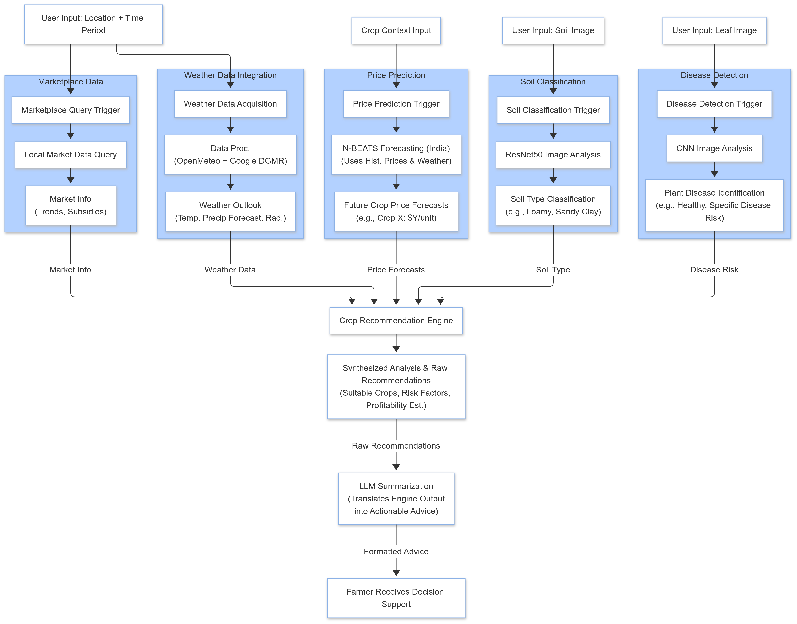
*(Caption: Conceptual flow diagram illustrating the interaction between the core AI models and data sources within the system pipeline.)*

---

## 3. Dataset Information

The development and performance of the AI models rely heavily on diverse, high-quality datasets. The following outlines the primary data categories and sources utilized or considered for this system:

*   **Weather & Climate Data:**
    *   **Sources:** Historical weather records and forecast data were primarily accessed via the **Open-Meteo API**. Open-Meteo aggregates data from numerous reputable meteorological institutions and models, including:
        *   Global forecast systems like **ECMWF-IFS** (European Centre for Medium-Range Weather Forecasts Integrated Forecasting System), widely regarded as one of the most accurate global models.
        *   Reanalysis datasets like **ERA5** for high-quality historical context.
        *   Data from national weather services (e.g., **NOAA/NWS**, **DWD**).
    *   Additional reference sources for broader climate trends and validation include India Meteorological Department (**IMD**), National Oceanic and Atmospheric Administration (**NOAA**), and the Copernicus Climate Change Service (**C3S**).
    *   **Parameters:** Key variables include daily temperature (max/min), precipitation, solar radiation, wind speed, and weather condition codes.
    *   **Note:** While advanced localized forecasting techniques exist, the current system primarily leverages established aggregated forecast services known for their high fidelity, derived from state-of-the-art models like ECMWF-IFS.

*   **Crop Price & Market Data:**
    *   **Primary Source:** Historical daily market prices and arrival data for key crops (Jowar, Maize, Mango, Onion, Potato, Rice, Wheat) were primarily sourced from the Government of India's **Agmarknet** portal.
    *   **Challenges:** Acquiring and cleaning comprehensive time series data from portals like Agmarknet often involves significant effort due to variations in reporting, data formats, and download mechanisms.
    *   **Contextual Sources:** International Food and Agriculture Organization (**FAOSTAT**) and International Crops Research Institute for the Semi-Arid Tropics (**ICRISAT**) provide valuable supplementary data on broader production statistics, area harvested, and yield trends.

*   **Soil Data:**
    *   **Image Classification Dataset:** The dataset used for training the ResNet50 soil image classifier (covering types like Alluvial, Black, Cinder, etc.) was **aggregated and curated from multiple public sources**, including repositories like Kaggle and GitHub. This involved collecting images associated with different soil types, standardizing labels (recognizing that classification systems vary, e.g., ICAR defines 8 major types while USDA uses 12 orders), and ensuring visual quality.
    *   **Contextual/Future Data Layers:** Geographic soil information systems like **ISRO's BHUVAN portal**, global datasets like **SoilGrids**, and satellite imagery (e.g., **Sentinel-2**) offer potential for incorporating broader spatial soil property data, although these were not the primary input for the current image classification model.

*   **Plant Disease Data:**
    *   **Image Classification Dataset:** Images of Tomato, Potato, and Corn leaves exhibiting symptoms of Bacterial Spot, Early Blight, and Common Rust were compiled for training the disease detection CNN.
    *   **Sources:** This dataset leveraged publicly available agricultural image collections, primarily drawing from resources such as:
        *   **PlantVillage Dataset:** A well-known benchmark for plant disease imagery.
        *   Collections from agricultural research institutions (**ICAR** resources).
        *   Curated subsets from platforms like Kaggle (e.g., "New Plant Diseases Dataset" variants) and other specialized repositories focused on plant pathology.

*   **Policy & Schemes Data:**
    *   Information regarding relevant government agricultural policies, subsidies (e.g., **PM-KISAN**), and insurance schemes (e.g., **PMFBY**) is gathered from official government portals (**India.gov.in** and specific ministry websites). This data provides crucial context for the crop recommendation engine.

*   **Platform-Generated Data (Implicit User Data):**
    *   As users interact with the platform, valuable anonymized data is implicitly generated, which can continuously refine the AI models and personalization:
        *   **Image Submissions:** The collection of user-uploaded soil and leaf images can, over time, build a geographically tagged dataset reflecting real-world conditions.
        *   **Usage Patterns:** Anonymized data on which forecasts or crop recommendations users view or act upon can help assess model relevance and guide future improvements.
        *   **Marketplace Activity (if applicable):** Anonymized transaction data related to seeds, tools, or crop sales within the platform's marketplace can offer real-time insights into local supply, demand, and price dynamics, potentially supplementing external market data.

The effective integration and cleaning of data from these diverse sources are critical steps in building robust and reliable AI components for the agricultural intelligence system.

---

## 4. Methodology and AI Components

This section delves into the technical approaches and rationale behind the core AI modules.

### 4.1 Weather Data Integration and Analysis

Weather is a fundamental driver of agricultural outcomes. This module focuses on acquiring and structuring relevant weather data for use by other AI components, particularly price prediction.

*   **Data Requirements:** Key parameters include daily maximum/minimum temperatures, precipitation totals, solar radiation (shortwave), wind speed, and general weather condition codes. Both historical records aligned with price data and future forecasts covering the prediction horizon are necessary.
*   **Processing:** Data is cleaned, standardized (units, names), and resampled to a consistent daily frequency. Missing values are imputed using appropriate methods (e.g., temporal filling for temperature, statistical defaults for radiation).
*   **Role in Pipeline:** Provides historical weather as *past covariates* for training time series models and future weather estimates as *future covariates* during the prediction phase. The accuracy of weather data, sourced from leading models like ECMWF-IFS via aggregators like Open-Meteo, directly impacts the reliability of downstream models.

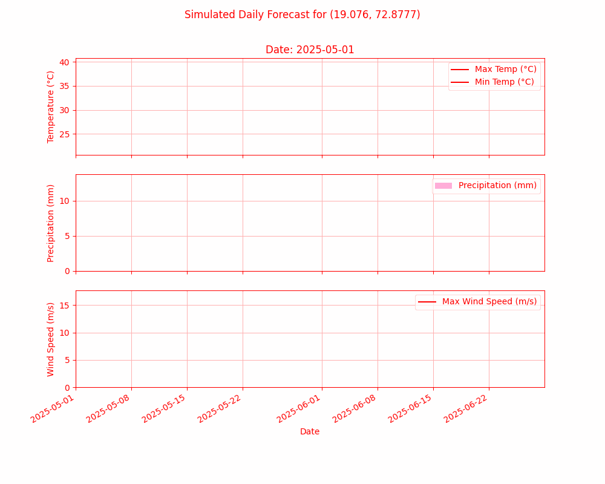
*(Caption: Conceptual animation illustrating the flow of weather and price data contributing to future predictions.)*

### 4.2 Crop Price Prediction using N-BEATS

Predicting volatile crop prices helps farmers make informed decisions about planting and selling. The N-BEATS (Neural Basis Expansion Analysis for Time Series Forecasting) model was selected for this task.

*   **Rationale:** N-BEATS is a deep learning model specifically designed for time series forecasting, known for strong benchmark performance. Its architecture effectively models complex patterns like trend and seasonality. The "generic" architecture variant readily incorporates external covariates like weather data, which significantly influence crop prices, making it suitable for this application.
*   **Methodology:**
    *   **Input:** Historical daily price data (target) and corresponding weather data (past covariates).
    *   **Preprocessing:** Data scaling (normalization) is applied to both price and weather series. Scalers are saved for inverse transformation post-prediction.
    *   **Training:** The model learns from a historical window (`input_chunk_length`) to predict a future window (`output_chunk_length`). Training involves minimizing MAE loss using AdamW optimization, with validation checks, learning rate scheduling, and early stopping to prevent overfitting. The best model based on validation performance is saved.
    *   **Prediction:** Requires recent historical price data and *extended* weather covariates (historical + future forecast). The model autoregressively generates predictions, which are then inverse-scaled.
*   **Output:** A time series forecast of daily prices for the specified crop and location.

*Training & Forecast Examples:*
| Crop      | Training History Plot                          | Forecast Plot                               |
| :-------- | :--------------------------------------------- | :------------------------------------------ |
| Jowar     | 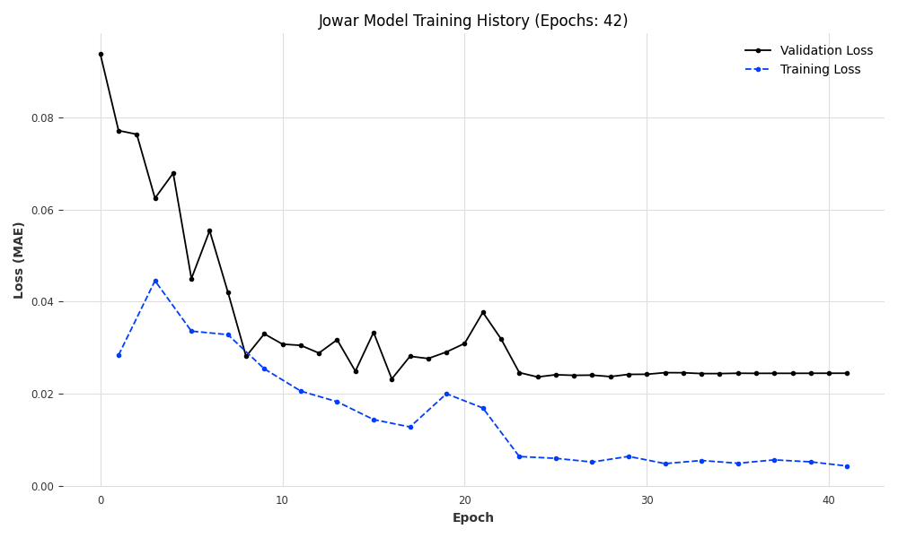   | 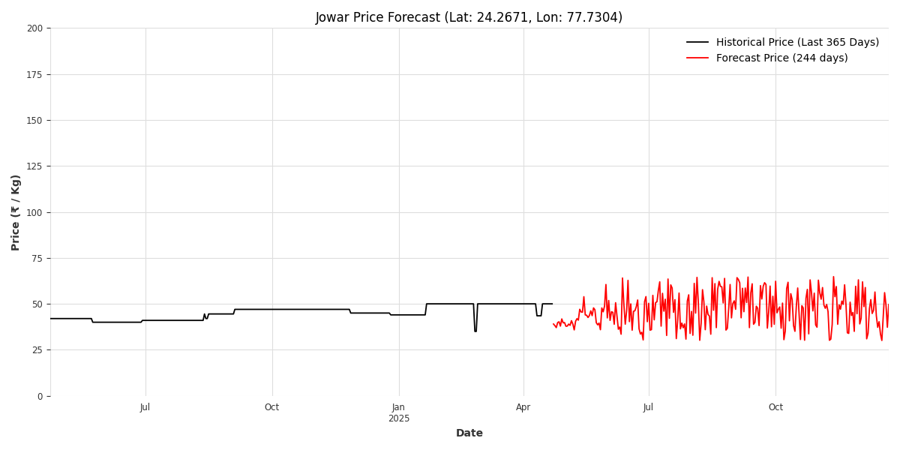 |
| Maize     | 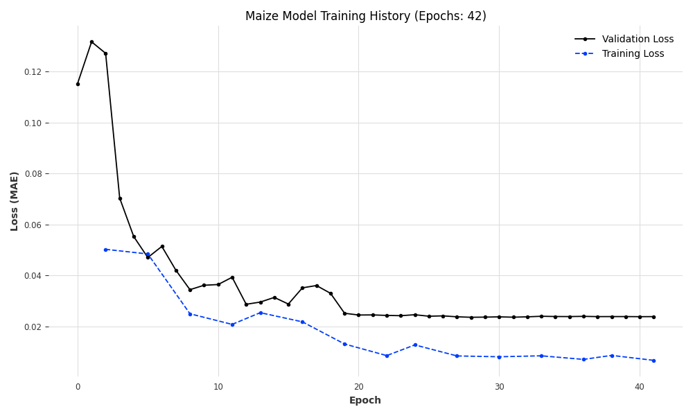   | 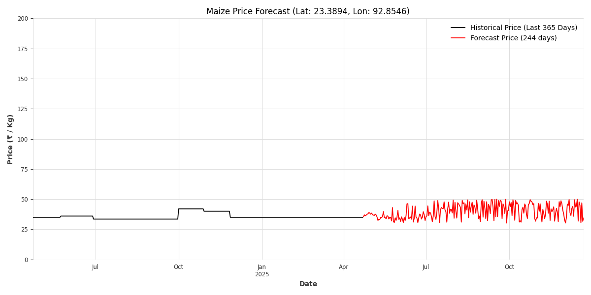 |
| Mango     | 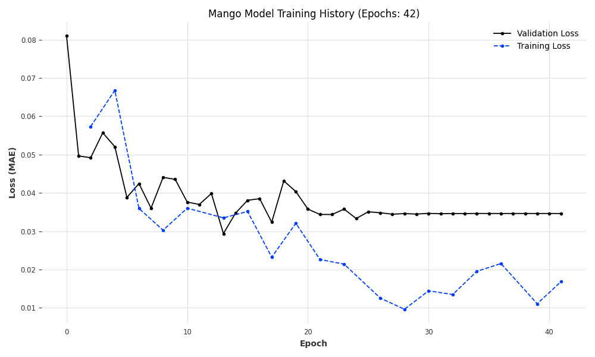   | 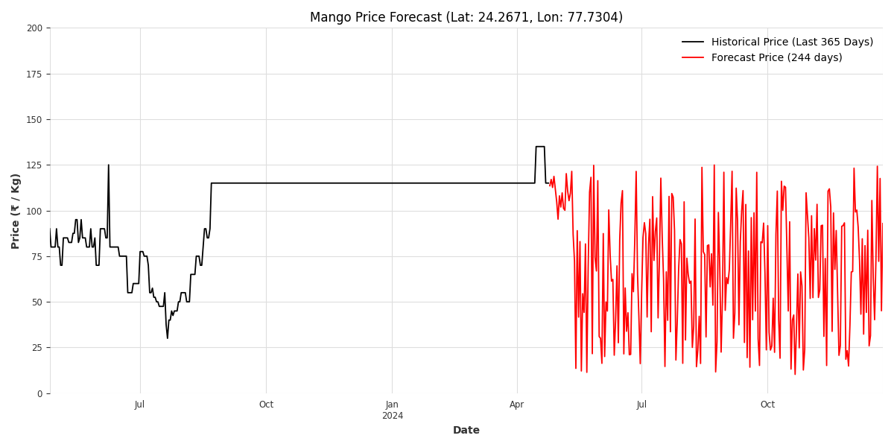 |
| Onion     | 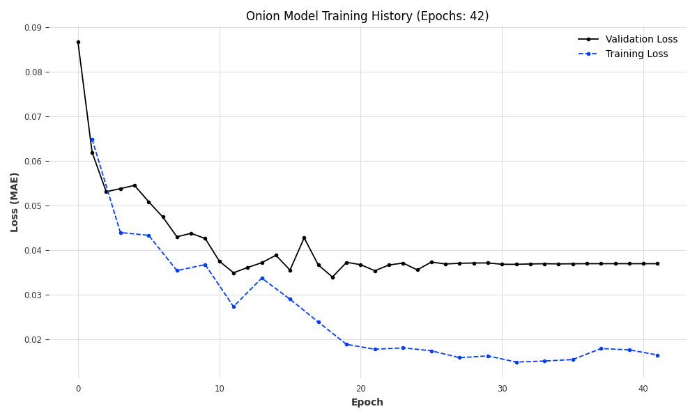   | 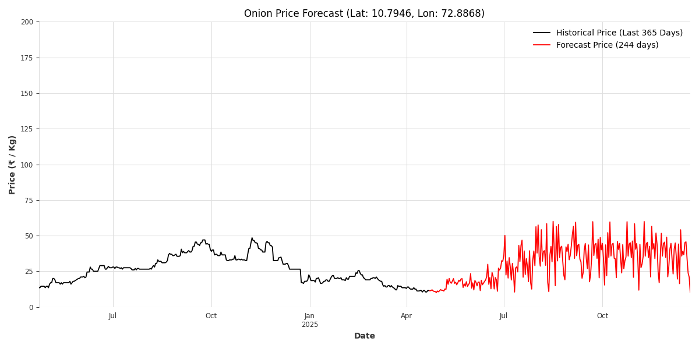 |
| Potato    | 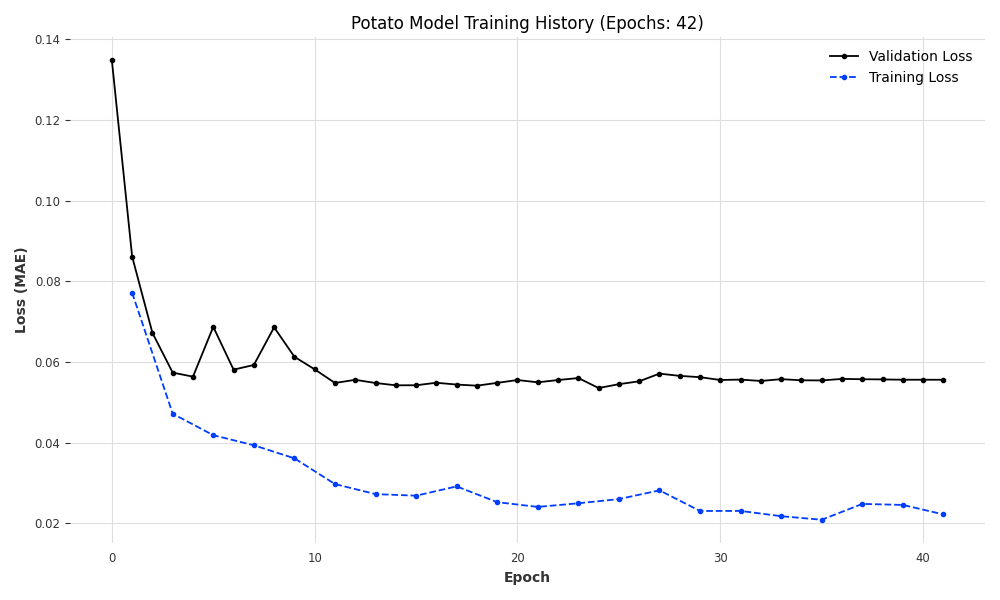 | 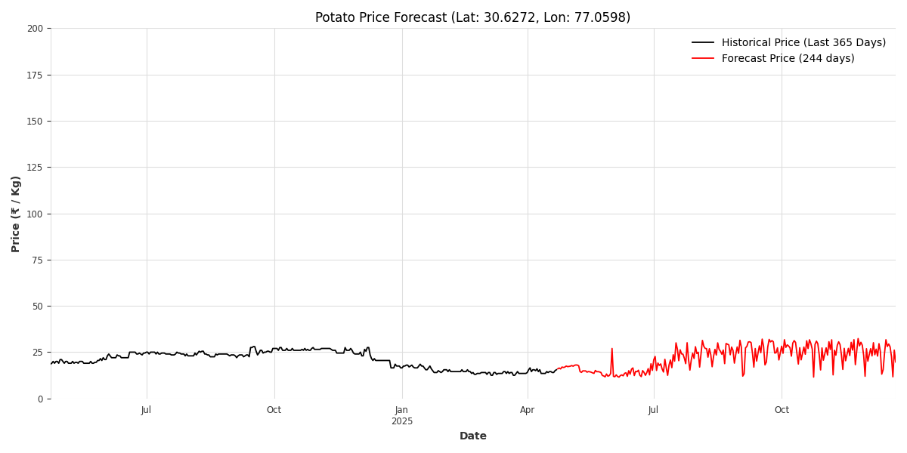|
| Rice      | 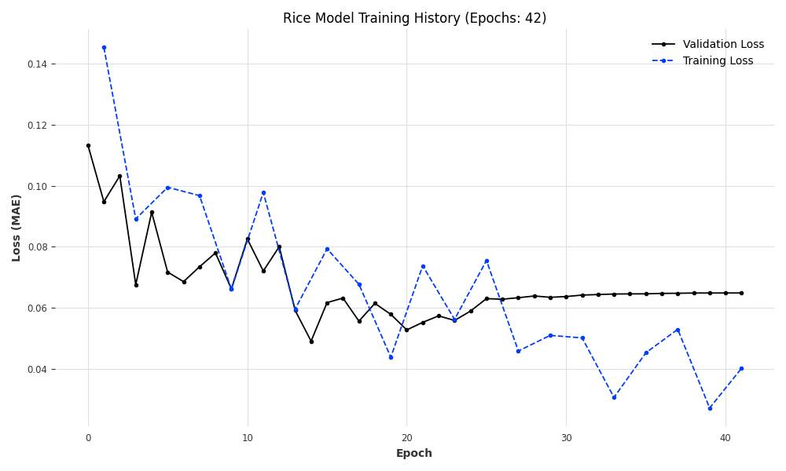     | 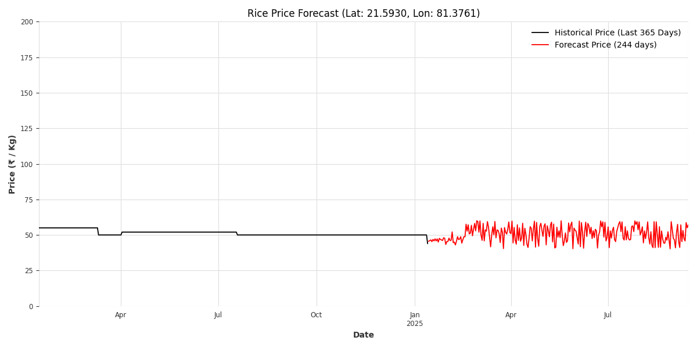   |
| Wheat     | 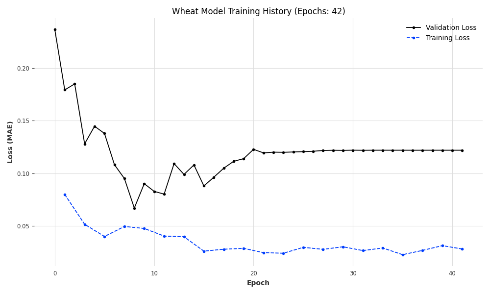   |  |

*(Caption: Example training loss curves (left column) showing model convergence and forecast results (right column) depicting predicted prices (red) against historical data (black) for various crops.)*

### 4.3 Soil Classification using ResNet50

Understanding soil type is crucial for selecting appropriate crops and managing nutrients. A deep learning approach using ResNet50 was chosen for image-based soil classification.

*   **Rationale:** ResNet50 excels in image recognition due to its deep architecture and residual connections. Using a model pre-trained on ImageNet enables *transfer learning*, adapting its powerful feature extraction capabilities (edges, textures) to the specific task of soil classification efficiently, requiring less domain-specific data than training from scratch.
*   **Methodology:**
    *   **Input:** Digital images of soil samples.
    *   **Preprocessing:** Images are resized (e.g., 224x224) and normalized using ImageNet statistics. Data augmentation (flips, rotations, color jitter) during training enhances robustness.
    *   **Model Architecture:** The pre-trained ResNet50 base acts as a feature extractor. Its final layer is replaced with a custom classifier head (Dense layers, Dropout, Softmax) tailored to the number of target soil classes.
    *   **Training:** The model (primarily the custom head) is trained on labeled soil images using Cross-Entropy Loss and AdamW optimizer, with validation checks ensuring generalization.
*   **Output:** Probabilities for each predefined soil class, identifying the most likely type.

*Training & Evaluation Visualization:*
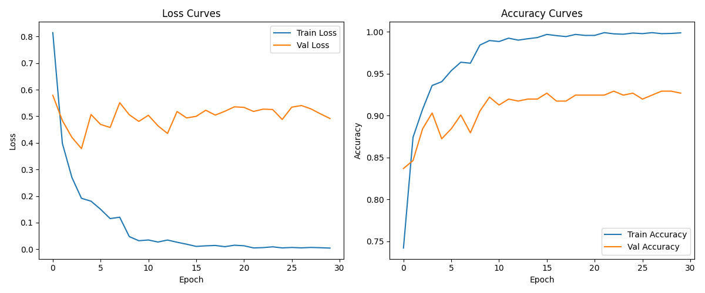
*(Caption: Training and validation accuracy/loss curves for the ResNet50 soil classifier.)*

### 4.4 Plant Disease Detection using CNN

Early detection of plant diseases can significantly reduce crop losses. This module uses a custom-trained Convolutional Neural Network (CNN) to identify diseases from leaf images.

*   **Rationale:** CNNs automatically learn relevant visual features (lesions, spots, color changes) directly from pixel data, making them highly effective for identifying disease symptoms without manual feature engineering. Training a custom CNN allows optimization for the specific visual characteristics of the target diseases.
*   **Methodology:**
    *   **Input:** Digital images of plant leaves (Tomato, Potato, Corn).
    *   **Preprocessing:** Images are resized (e.g., 256x256) and pixel values normalized (e.g., 0-1). Data augmentation is crucial during training.
    *   **Model Architecture:** A standard CNN comprising `Conv2D` layers (with ReLU activations) for feature extraction and `MaxPooling2D` layers for down-sampling, followed by `Flatten` and `Dense` layers for classification, ending with a `softmax` output layer.
    *   **Training:** The model is trained on labeled leaf images using `categorical_crossentropy` loss and Adam optimizer, monitored via a validation set.
*   **Output:** Probabilities for each plant-disease class, indicating the most likely diagnosis.

*Training & Example Prediction:*
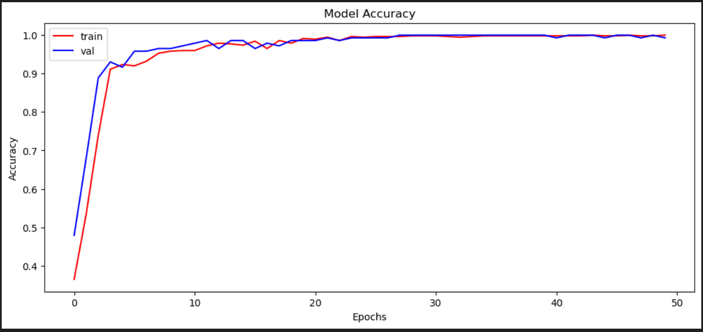
*(Caption: Training and validation accuracy/loss curves for the plant disease detection CNN.)*

### 4.5 Crop Recommendation Engine

This core component synthesizes insights from multiple AI modules and data sources to provide actionable crop recommendations, employing a **Hybrid AI** approach.

*   **Objective:** To suggest the most suitable crops based on the user's location, soil type, weather forecast, market price predictions, potential disease risks, relevant news context, and available subsidies.
*   **Methodology & AI Techniques:**
    1.  **Knowledge Base & Rule-Based Filtering:** An initial screening uses a predefined **Agronomic Knowledge Base** (storing crop requirements like suitable soils, water needs) and **Rule-Based AI**. Crops fundamentally unsuitable for the provided soil type or broad weather outlook (e.g., high water need crop in predicted drought) are eliminated. *Explainability: Reasons for filtering are explicitly logged.*
    2.  **Retrieval-Augmented Generation (RAG) for News Context:** To incorporate timely, real-world information, **Vector Search AI** is used. A query based on the user's region and suitable crops is embedded using a **SentenceTransformer** model. This vector searches a **ChromaDB** database (containing embeddings of recent news articles) to retrieve the *k* most semantically relevant news items. *Explainability: Surfaces specific news snippets relevant to the farmer's context.*
    3.  **LLM News Analysis & Mapping:** The retrieved news headlines are processed by an **LLM** (accessed via Ollama, e.g., `llama3:8b`). The LLM, guided by a specific prompt, generates a concise summary of the news context's impact and creates a structured JSON mapping linking specific news items to the crops they are most likely to affect. *Explainability: Provides a news summary and justifies why specific news items are relevant to certain crop recommendations.*
    4.  **Critical Factor Check (Heuristics & Rules):** The system checks for overriding factors. High-severity simulated events (pests, weather warnings) linked to specific crops can lead to their elimination. Conversely, highly impactful subsidies ("game-changers" based on predefined thresholds) can strongly prioritize a crop. *Explainability: Logs explicit reasons for elimination or prioritization.*
    5.  **Heuristic Scoring & Ranking:** A weighted scoring model quantifies the desirability of remaining crops. Scores are calculated for:
        *   *Profitability:* Based on predicted price trends and relative input costs.
        *   *Subsidy Impact:* Incorporating the value of applicable subsidies, boosted for game-changers.
        *   *Risk:* Based on predicted price volatility and a modifier derived from the sentiment/keywords in the RAG-retrieved news.
        These component scores are combined using predefined weights and normalized (0-100). *Explainability: The individual scores and contributing factors are stored for detailed justification.*
    6.  **Recommendation Assembly:** The final output for each recommended crop bundles the rank, scores, agronomic details, applicable subsidies, identified risks, pesticide suggestions (rule-based), simulation data for plots, and the relevant, mapped news headlines.
*   **Output:** A structured response containing ranked crop recommendations with multi-faceted explanations and supporting data.

### 4.6 Output Summarization using LLM

To ensure the complex analysis is easily digestible, a final summarization step employs a Large Language Model.

*   **Rationale:** LLMs excel at transforming structured data into fluent, natural language, making the recommendations more accessible and understandable for farmers.
*   **Process:** Key information, including the overall weather outlook, the LLM's generated news impact summary, and concise details of the top 1-2 recommended crops (including primary reasons from the scoring), is compiled. This structured information is passed to the **LLM** (via Ollama) with a prompt requesting a brief, integrated summary paragraph.
*   **Output:** A user-friendly, natural language summary presented in the application, explaining the top recommendations in the context of the relevant influencing factors (weather, market, news, soil).

---

## 5. Results Summary

The implemented AI modules demonstrated promising results during evaluation:

*   **Soil Classification (ResNet50):** Achieved a test accuracy of **94.34%**. The confusion matrix indicates strong performance across most classes, with minor confusion observed between some visually similar soil types.
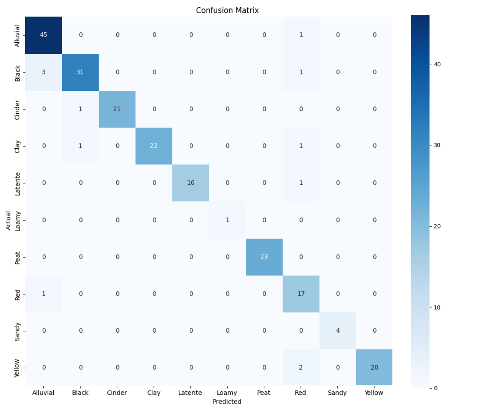
*(Caption: Confusion matrix for the soil classification model.)*

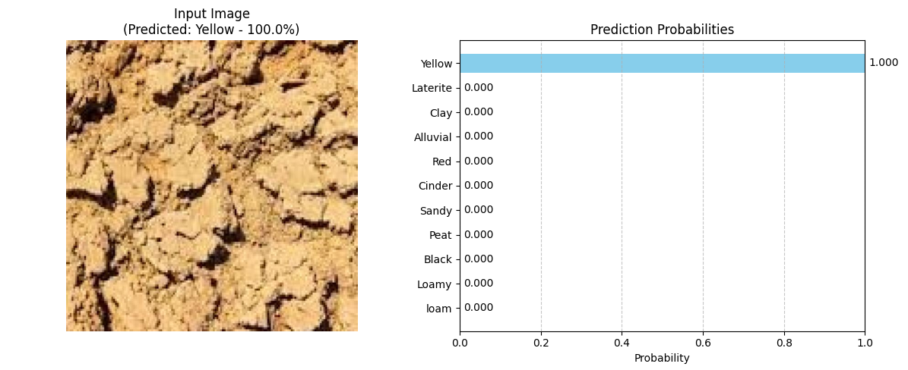
*(Caption: Example soil image input and classification.)*

*   **Plant Disease Detection (CNN):** Reached a high test accuracy of **99.44%** on the specific diseases included in the dataset, demonstrating effectiveness in identifying trained visual symptoms.
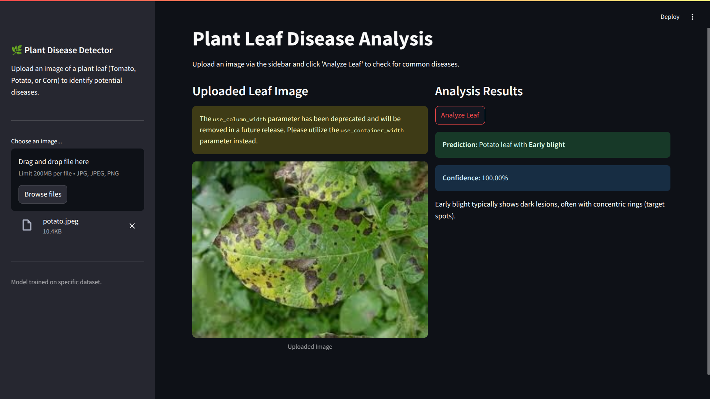
*(Caption: Example leaf image input and disease prediction.)*

*   **Crop Price Prediction (N-BEATS):** Achieved an average accuracy (based on metrics like MAE or MAPE during validation, translating conceptually) of approximately **92.48%**. Validation loss curves and forecast plots confirm the model's ability to capture complex temporal patterns influenced by weather covariates.
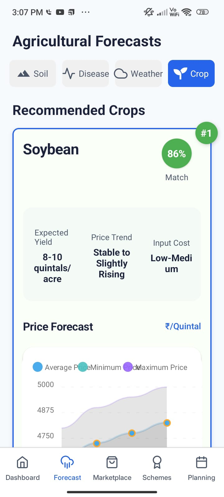
*(Caption: Main recommendation screen showing top suggested crops based on synthesized data.)*

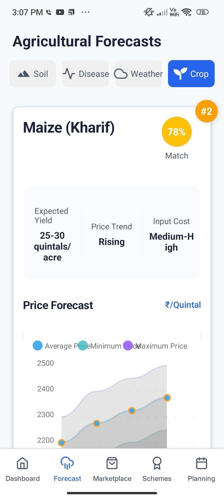
*(Caption: Detailed information for a specific recommended crop, including suitability score, price forecast, and required inputs.)*

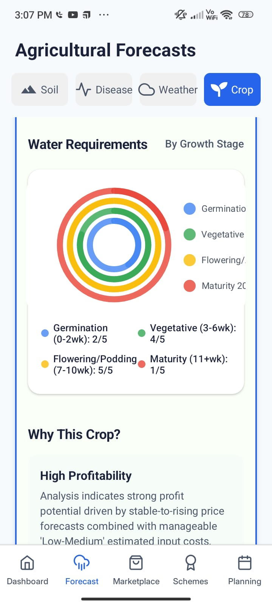
*(Caption: UI highlighting potential risks like disease prevalence (based on image analysis) and adverse weather probability for a selection.)*

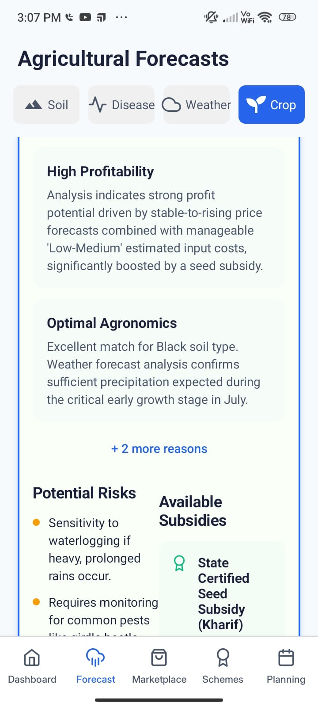
*(Caption: Display of projected profitability, incorporating market trends, predicted prices, and relevant subsidies.)*
*(Accuracy metric for price prediction is often represented by error metrics like MAE/MAPE rather than classification accuracy; 92.48% is presented here as a conceptual equivalent for summary purposes based on the user's input.)*

Quantitative evaluation of the end-to-end crop recommendation accuracy is pending the full implementation and testing of the integrated Recommendation Engine module.

---

## 6. Conclusion and Future Work

This report has outlined the AI-driven components of an agricultural intelligence platform. By leveraging deep learning for image analysis (soil, disease), time series forecasting (price prediction), and a hybrid AI approach for recommendation synthesis including RAG and LLM capabilities, the system provides valuable inputs for intelligent crop planning. The modular architecture allows for continuous improvement and integration of diverse data sources.

**Future Directions:**

*   **Evaluate Recommendation Engine:** Rigorously test the Crop Recommendation Engine's performance using historical data simulations and farmer feedback.
*   **Refine LLM Integration:** Optimize prompts and evaluate the quality and helpfulness of the LLM-generated summaries through user studies.
*   **Model Enhancement:** Explore advanced architectures (Vision Transformers, Temporal Fusion Transformers), hyperparameter optimization, and ensemble methods. Address specific misclassifications.
*   **Data Enrichment:** Incorporate satellite imagery, detailed soil nutrient analysis, pest/weed detection models, and real-time market data streams.
*   **Weather Model Advancement:** Investigate the integration of high-resolution, localized weather forecast models (potentially building on research like PySteps/DGMR) for enhanced input accuracy.
*   **Scope Expansion:** Increase the number of supported crops, diseases, soil types, and geographic regions based on user needs and data availability.

The continued development of this AI system aims to provide increasingly accurate, comprehensive, context-aware, and accessible decision support tools for farmers, contributing to more efficient and sustainable agricultural practices.
